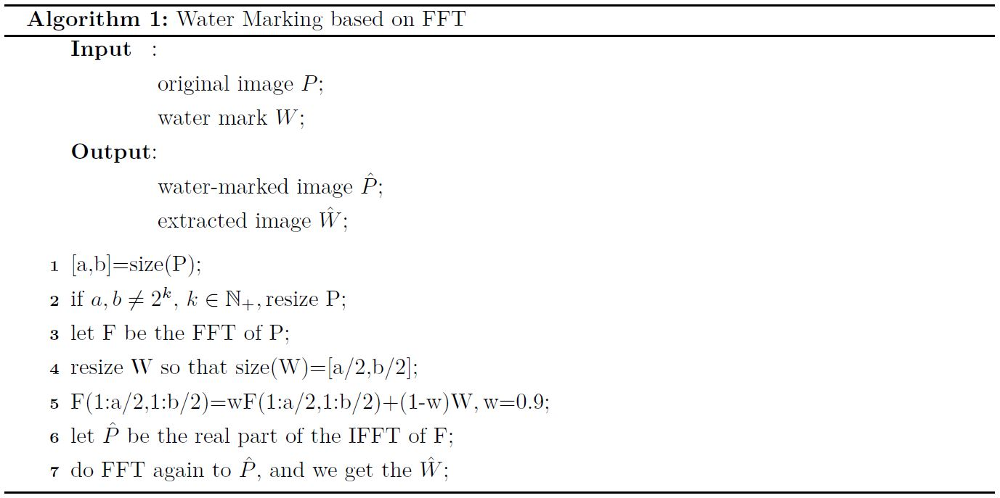
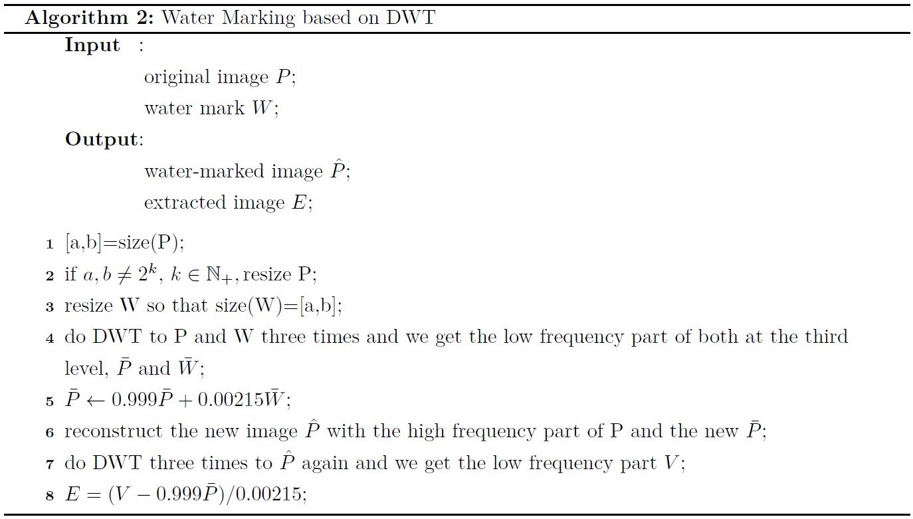
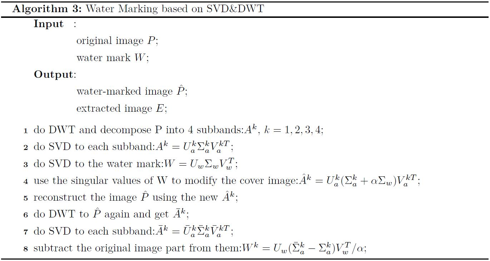

# Watermarking
This project realized three basic ways to do watermarking with matlab.

## FFT-based watermarking

Just open the file *watermarking.m* with your matlab and run it, then you will see how *watermark1.jpg* is inserted into the FFT of *test.jpg*.

## DWT-based watermarking

[paper link](https://www.researchgate.net/publication/267988699_Image_Watermarking_Using_3-Level_Discrete_Wavelet_Transform_DWT)
Open the file *watermarking.m* with your matlab and run it, then you will see how *panda.jpg* is inserted into the FFT of *test.jpg*. After that, run *extracting.m* and the watermark can be extracted from the embedded picture.

## SVD&WDT-based watermarking

[paper link](https://pdfs.semanticscholar.org/5bba/7f16c7bb298759d9a25fe76140513f25c22d.pdf)
Open the file *embedding.m* with your matlab and run it, then you will see how *panda.jpg* is inserted into the FFT of *test.jpg*. After that, run *reconstructing.m* and the watermark can be extracted from the embedded picture.